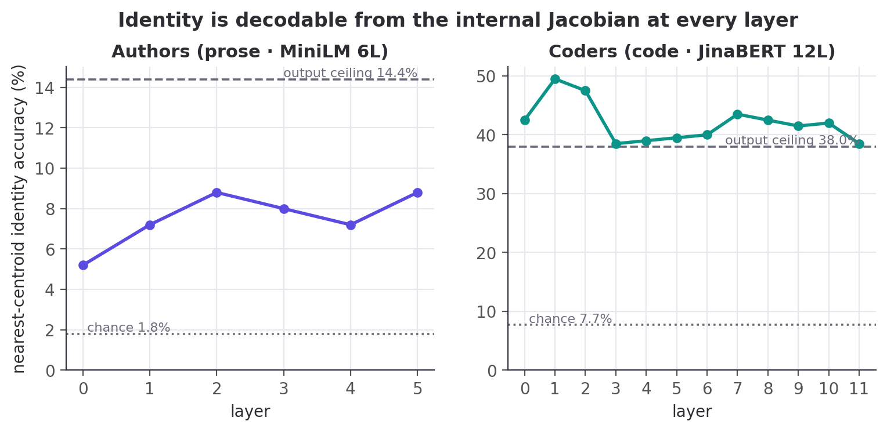
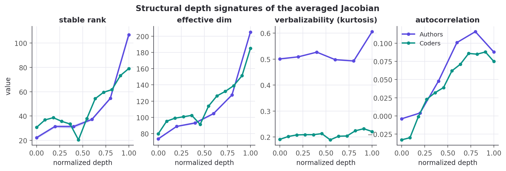
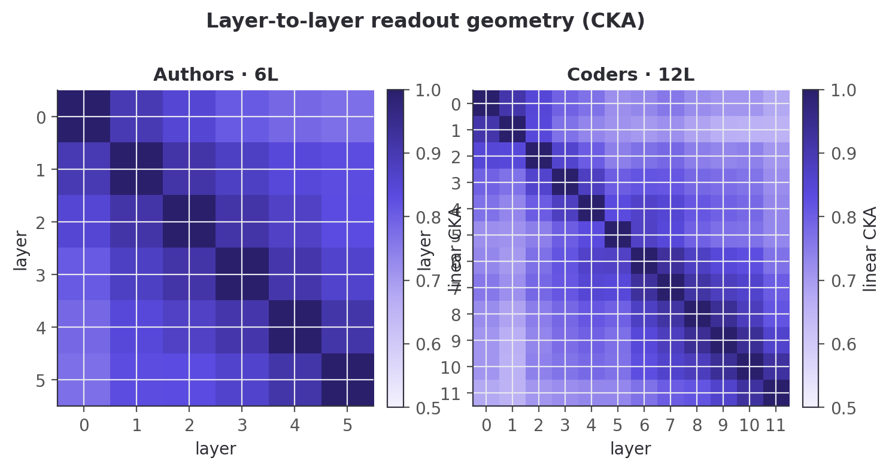
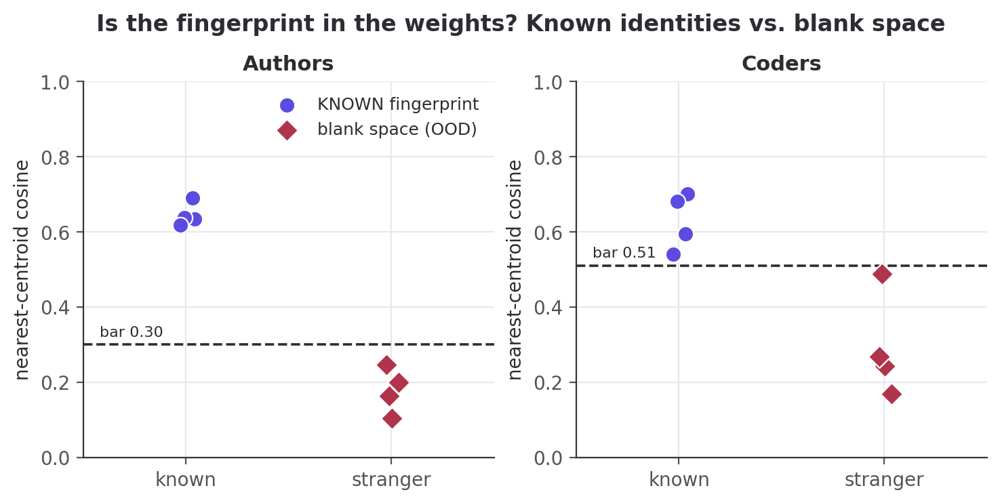
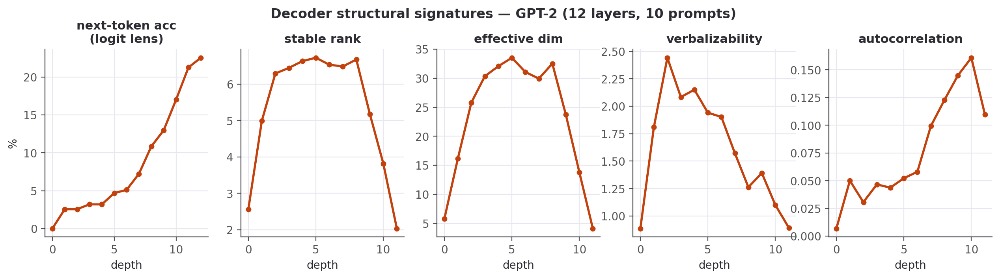
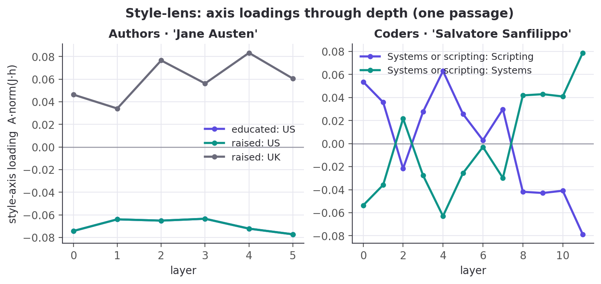
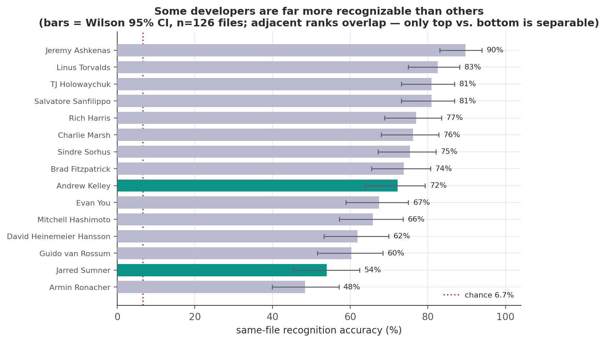

# Author2vec: A Jacobian Lens for Authorship Identity in Embedding Encoders

**Tristen Harr** · Brahmastra Labs · [author2vec.com](https://author2vec.com)
**Alexander Stepanov** · UC Berkeley

> **Status: complete draft (autonomous research build), not yet shipped.** All experiments
> (Phases 0–5) have been run; every quantitative claim is traced to a shipped data bundle in the
> audit ledger (Appendix D). This document is written against `jlens/paper/ledger.json` — no
> number appears here that is not in the ledger.

---

## Abstract

Anthropic's *"Verbalizable Representations Form a Global Workspace in Language Models"*
introduces the **averaged-Jacobian lens (J-lens)** and uses it to argue that a large,
closed **decoder** (Claude Sonnet 4.5, 127 layers) maintains a privileged "workspace" of
verbalizable, causally-active concepts. We adapt that mechanistic apparatus to a setting the
method was not designed for — small, **open embedding encoders** whose output is a single
masked-mean-pooled vector — and re-point it at a different question: **personal writing
style / authorship identity**. Three ingredients make the transplant work: (i) a
**δ-broadcast reduction** that collapses the encoder's position×position Jacobian to a single
per-layer matrix; (ii) an **embedding-space projection** that removes the meaningless radial
direction of a normalized embedding; and (iii) a **style lens** — a readout that projects the
layer Jacobian onto empirically-recovered, human-interpretable identity axes instead of the
token vocabulary. On a 6-layer prose encoder (MiniLM) and a 12-layer code encoder (JinaBERT)
we find that **author identity is a computed intermediate, decodable above chance at every
layer** (not merely an output artifact), that the two encoder depths expose different
low-rank "workspace" geometry, and that the identity direction is both a **detector** (is a
person's fingerprint in the weights at all?) and a **causal lever** (steering). We further
run an **identity-ignition** experiment (does the representation commit to a single
individual at a characteristic depth?), a **decoder** track, and a **directed-steering**
experiment. Everything runs on open models and ships as static assets; the whole apparatus
is reproducible on a laptop. We are explicit about what is **replication** vs. **new**, and
about what we **do not** claim: no "IQ", no consciousness.

## Contributions

1. **An encoder adaptation of the averaged-Jacobian J-lens** via the δ-broadcast reduction
   (§4.2) — the paper's method redefined for a masked-mean-pooled, non-generative encoder.
2. **An embedding-space Jacobian projection** for L2-normalized outputs (§4.3), unit-tested
   orthogonal to the embedding.
3. **The style lens** (§4.5): a Jacobian readout onto interpretable identity axes rather than
   the token vocabulary — the trustworthy signal where an encoder has no clean unembedding.
4. **Identity is a computed intermediate** (§5.1): author identity decodes above chance from
   the internal Jacobian at *every* layer, with the best internal code layer exceeding the
   output-embedding ceiling.
5. **A fingerprint-presence detector** (§5.4): known identity vs. "blank space" for
   out-of-distribution text — a question the paper does not ask.
6. **Identity ignition** (§5.2): the representation commits to a single individual increasingly
   with depth, peaking mid-network, above two null controls — on both prose and code.
7. **Causal steering & directed modulation** (§5.4, §5.6): the identity direction is a
   sign-controllable lever on encoders, and a leakage-free concept direction is a (modest but
   real) causal handle on a decoder's output.
8. **An open, reproducible, browser-native reimplementation** across two modalities (prose &
   code), with a faithfulness gate and a full audit ledger.

---

## 1. Introduction

Recent interpretability work argues that large language models maintain a privileged, verbalizable
"workspace" of representations — a small subset of activations that are reportable, controllable,
and causally responsible for reasoning [@workspace2026]. That evidence comes from a *generative
decoder* with hundreds of billions of parameters and privileged internal access, read out with an
**averaged-Jacobian lens** onto the token vocabulary. It is a striking picture, but it is expensive
to reproduce and impossible to inspect from the outside.

We ask a different, smaller, checkable question with the same apparatus: **where, inside a network,
does *who wrote this* become decidable?** We take the averaged-Jacobian lens and move it from a
frontier decoder to two small, open, *embedding encoders* — a 6-layer prose model (MiniLM) and a
12-layer code model (JinaBERT) — and re-point it from reasoning onto **personal writing-style
identity**. An encoder is a clean minimal testbed for the paper's *mechanistic* claims precisely
because it strips away generation: there is no autoregressive loop to smuggle information through,
just a fixed map from text to a single pooled vector. It cannot, however, speak to the paper's
*behavioral* claims (verbal report, reasoning swaps); those need a decoder, which we take up
separately (§5.5–5.7).

Carrying the lens across that gap takes three ingredients (§4): a **δ-broadcast reduction** that
collapses the encoder's intractable position×position Jacobian to one matrix per layer; an
**embedding-space projection** that removes the meaningless radial direction of a normalized
output; and a **style lens** that reads the layer Jacobian onto interpretable identity axes rather
than the token vocabulary — the trustworthy signal where an encoder has no clean unembedding.

With these we find that **author identity is a computed intermediate, decodable above chance at
every layer** (§5.1), not merely an artifact of the output embedding; that an ambiguous
two-author input causes the internal representation to **commit to a single author increasingly
with depth**, peaking in a mid-network band and surviving two null controls (§5.2, ignition); that
the same geometry yields a **fingerprint-presence detector** distinguishing a known identity from
"blank space" (§5.4); and that these signatures hold across two modalities, prose and code. We are
explicit throughout about what is a faithful **replication** of the paper's apparatus versus what
is **new** here, and about what we deliberately do **not** claim: no "IQ", no consciousness. The
contributions are listed above; every number is reproducible from the audit ledger (Appendix D).

## 2. Related work

**Lenses on the residual stream.** The logit lens [@nostalgebraist2020logitlens] reads
intermediate activations through the unembedding; the tuned lens [@belrose2023tunedlens] learns
an affine correction per layer. The averaged Jacobian of [@workspace2026] generalizes this by
linearizing the *whole* map from a layer to the output and averaging over a corpus. We inherit
that construction and adapt it to a pooled encoder (§4.2); our vocab lens is a logit lens over
tied WordPiece embeddings, and our *style lens* (§4.5) replaces the vocabulary readout with one
onto interpretable directions — the piece that is new here.

**Steering and concept directions.** Activation addition [@turner2023actadd] and contrastive
activation addition [@rimsky2024caa] steer generation by adding a direction to the residual
stream; representation engineering [@zou2023repe] extracts such directions, often as a
difference of class means. Our identity axes are exactly difference-of-means (Fisher)
directions, used both to *read* (§4.5) and to *steer* (§5.4); the novelty is not the technique
but the target — personal authorship identity — and reading it *through the layer Jacobian*.

**Probing and representational geometry.** Linear probes [@alain2017probing;
@hewitt2019structural] test what a layer linearly encodes; we use leave-one-out nearest-centroid
decoding as a probe of *identity* across depth (§5.1). Linear CKA [@kornblith2019cka] compares
representations between layers, which we apply to J-lens readout geometry (§4.7). Sparse
dictionary learning / SAEs [@bricken2023monosemanticity] decompose activations into
interpretable atoms; the paper's J-space decomposition is a supervised cousin we reuse (§4.6).

**Global workspace and authorship.** The framing of [@workspace2026] draws on global workspace
theory [@baars1988workspace] and the "ignition" of conscious access [@dehaene2011ignition]; we
borrow the *ignition* experimental design (§5.2) but point it at identity, and we make no claim
about consciousness. Our substrate is Sentence-BERT-style embeddings [@reimers2019sbert], and
the downstream question — attributing text to its author from style — is classical authorship
attribution / stylometry, here recast as a question about *where in a network* identity is
computed. Throughout, the J-lens, J-space, and structural signatures are the paper's; our
contribution is their transplant to open encoders, the style-lens readout, the identity target,
and full reproducibility.

## 3. Background: the averaged-Jacobian lens

We build directly on the apparatus of [@workspace2026], which we summarize here so that our
adaptation (§4) and its boundaries are unambiguous.

**The J-lens.** For a causal decoder, the *averaged Jacobian* at layer $\ell$ is
$$ J_\ell \;=\; \mathbb{E}_{t,\,t'\ge t,\,\text{prompt}}\!\left[\frac{\partial h_{\text{final},t'}}{\partial h_{\ell,t}}\right], $$
the linearized effect of a layer-$\ell$ activation on the final residual stream, averaged over
token positions and a corpus of prompts. Read through the unembedding it yields, for any
activation, a ranked list of vocabulary tokens the model is "disposed to say" — a corrected
logit lens that accounts for representational change across layers.

**J-space and its privilege.** Activations are decomposed into sparse non-negative
combinations of $k$ ($\approx 10$–$25$) J-lens vectors; the *J-space component* is the part of
an activation lying in that cone. Though it accounts for only $\sim 6$–$10\%$ of a concept
vector's variance, it is the part causally responsible for the concept's availability to
verbal report, and it is subject to top-down control (instructing the model to "focus on X"
loads X), mediates unverbalized reasoning intermediates (swapping a J-lens vector redirects
downstream answers), and is required for deliberate — but not automatic — tasks.

**Structural depth signatures.** Four quantities, read off $J_\ell$ across depth (the paper's
Figure 28), identify a workspace band: next-token-prediction accuracy of the readout, its
*excess kurtosis* (peakiness), the *autocorrelation* of the top lens token across positions
(persistence of abstract content), and the readout's *effective linear dimensionality*. All
four mark a consistent sensory → workspace → motor tripartition — noisy early layers, a
coherent middle band, and output-aligned late layers — corroborated by an ambiguous-input
"ignition" experiment in which the representation snaps to one interpretation at workspace
onset. The study is conducted on Claude Sonnet 4.5 (127 layers; workspace $\approx$ L38–92)
and corroborated on Haiku/Opus.

**The gap we step into.** Every one of these constructs is defined for a *generative decoder*
with per-position next-token logits. An embedding encoder has neither: its output is a single
pooled vector. §4 is what it takes to carry the mechanistic half of this apparatus across that
gap — and §5.2, §5.5–5.7 are our attempts at the behavioral half the encoder cannot reach.

## 4. Method

**Setup.** We study two open **embedding encoders**: `sentence-transformers/all-MiniLM-L6-v2`
(prose; 6 layers, $d=384$, vocab 30{,}522) and `jinaai/jina-embeddings-v2-base-code` (code;
12 layers, $d=768$, vocab 61{,}056). Each maps a passage to one **masked-mean-pooled**,
L2-normalized vector $p$. A **faithfulness gate** (`bin/spike`) asserts our native candle
forward reproduces the shipped fastembed embeddings at cosine $>0.99$ before any Jacobian is
trusted.

### 4.1 The problem an encoder poses
The causal J-lens is defined per token position toward next-token logits. An encoder emits a
single pooled vector and no logits, so the per-position causal Jacobian is undefined here.

### 4.2 δ-broadcast averaged Jacobian
We perturb **every** source position by a shared displacement $\delta$ and differentiate the
pooled output, collapsing the position×position Jacobian to one matrix per layer:
$$ J_\ell \;=\; \frac{1}{T}\,\frac{\partial p}{\partial \delta}\;\in\;\mathbb{R}^{d\times d}. $$
$J_\ell$ is built by **batched central finite differences** ($\varepsilon=0.05$, pure gemm),
not per-dimension autograd. `lib.rs:layer_jacobian`. (Derivation: Appendix A.)

### 4.3 Embedding-space projection
Because $p$ is L2-normalized, its radial direction carries no information, so we project:
$$ J_{\text{emb}} \;=\; \tfrac{1}{\lVert p\rVert}\,(I - e e^{\top})\,J_{\text{raw}},\qquad e = p/\lVert p\rVert, $$
which is unit-tested to satisfy $e^{\top}(J_{\text{emb}}v)\approx 0$. `lib.rs:to_embedding_jacobian`.

### 4.4 Vocabulary (logit) lens
Standardized $J\!\cdot\!h$ times the tied WordPiece embeddings $W_U$ → top tokens. Noisy here
(the checkpoint ships no trained MLM head); reported but not load-bearing. `lib.rs:vocab_topk`.

### 4.5 Style lens (novel)
We read the Jacobian onto interpretable **identity axes** instead of the vocabulary:
$$ s_a(h) \;=\; A_a \cdot \operatorname{normalize}(J_{\text{emb}}\,h),\qquad
   A_a = \operatorname{normalize}\big(\bar{c}^{+}_a - \bar{c}^{-}_a\big), $$
each axis a unit **difference-of-class-means** (Fisher) direction over the reference
embeddings. Shipped axes — prose: `male ↔ female`, `educated=England ↔ rest`,
`educated=US ↔ rest`, `raised=England ↔ rest`, `raised=US ↔ rest`; code:
`Systems ↔ rest`, `Scripting ↔ rest`. `lib.rs:style_scores`, `axis`, `author_axes`.

### 4.6 J-space decomposition
Non-negative matching pursuit over unit rows of $W_U J_\ell$ yields a sparse concept set and
the fraction of activation variance it captures. `lib.rs:jspace_nmp`.

### 4.7 Structural depth signatures
Per layer: **stable rank** $\lVert J\rVert_F^2/\sigma_1^2$, **effective dimension**
(participation ratio $\lVert J\rVert_F^4/\lVert J^\top J\rVert_F^2$), **verbalizability**
(excess kurtosis of the vocab-lens readout), **layer×layer linear CKA**, and — completing the
paper's four-metric set — **autocorrelation** (lag-1 readout persistence vs. a position-shuffled
null). `lib.rs:stable_rank`,
`effective_dim`, `excess_kurtosis`, `linear_cka`.

## 5. Experiments and results

### 5.1 Identity is a computed intermediate



Decoding author identity by leave-one-out nearest-centroid on the **internal** per-layer
Jacobian readout beats chance at **every** layer: prose per-layer
$[5.2, 7.2, 8.8, 8.0, 7.2, 8.8]\%$ against a $1.8\%$ chance and a $14.4\%$ output ceiling; code
per-layer up to $49.5\%$ against a $7.7\%$ chance — the **best internal layer exceeds the
$38.0\%$ output-embedding ceiling**. Identity is computed inside the layers, not merely
emitted. _(All values: ledger `identity_*`.)_

### 5.2 Identity ignition — does the space collapse to a single person?

We adapt the paper's ambiguous-input ignition to identity. For an author pair $(A,B)$ we build
a per-depth difference-of-means axis $\hat u_\ell = \widehat{c_{A,\ell}-c_{B,\ell}}$ from their
*training* passages, then blend two *held-out* passages at the input embedding,
$h_0(\alpha)=(1-\alpha)h_0^{B}+\alpha h_0^{A}$, sweep $\alpha\in[0,1]$, and read the commitment
$s_\ell(\alpha)=\hat u_\ell\!\cdot\!(\bar p_\ell(\alpha)-m_\ell)$ at every depth (15 pairs). A
graded layer ramps linearly in $\alpha$; an *ignited* layer snaps.


**The representation commits to one author, increasingly with depth.** Endpoint separation along
the identity axis rises from $0.36$ at the input to a **mid-network peak of $0.95$ at depth 4**
(of 6), then eases to $0.54$ at the output — and it dominates both controls at every depth: the
random-direction null sits at $0.06$–$0.14$ (a $\sim\!7\times$ margin at the peak) and the
shuffled-label null at $0.12$–$0.47$. So the effect is **identity-specific**, not a generic
consequence of blending inputs. The **ignition index** (transition sharpness, $0$ = graded, $1$
= all-or-none) climbs from $0.09$ at the input — where the readout is, correctly, linear in the
blended input — to $0.73$–$0.74$ by mid-depth and holds. In short: *shallow layers hold a graded
mixture; by the middle of the network the representation has snapped to a single author.* The
mid-network peak echoes the low-rank "workspace" bottleneck we see structurally (§5.3).

**The same holds for code, more strongly.** On the 12-layer code encoder the ignition index
climbs from $0.09$ at the input to a peak of $0.82$ (depth 11 of 13), and the
identity axis separates coders **$\sim\!13\times$ above the random-direction null** at its
early-mid peak (depth 4: $1.21$ vs $0.09$) — a sharper version of the same effect, consistent
with code identity being more linearly accessible overall (§5.1). (Separation spikes higher still
at the final layer, $2.33$, but that depth is noisy — its null jumps too — so we feature the
stable early-mid peak.) Both modalities show the representation committing to one individual with
depth.

*Honesty.* This is a 6-layer encoder and 15 pairs; the sharpening is measured *along an axis the
separation control proves is identity-specific*, but we cannot fully exclude that some of the
depth-wise sharpening reflects generic late-layer nonlinearity. We report the raw depth series.

### 5.3 Structural signatures across depth





Effective dimension rises with depth in both models (prose $73\!\to\!205$; code $80\!\to\!184$).
The **stable rank** tells the sharper story: in the 6-layer prose model it is **lowest at the
very first layer** ($22.1$, rising to $106.9$) — the network compresses to a
low-rank readout immediately — whereas the 12-layer code model has a genuine **mid-network
low-rank bottleneck** (minimum $20.3$ at layer 5 of 12, with a matching dip in effective
dimension). The mid-network "workspace" geometry the paper reports in deep models appears here
**only once there is depth to spare**. The fourth signature, **autocorrelation** (persistence of
the readout across positions), completes the picture: near zero or negative at the shallowest
layers and rising through the middle (prose peaks at $0.12$ around layer 4; code climbs to
$\approx 0.09$ by layers 8–9), the workspace-persistence signature of [@workspace2026] surfacing
even on these shallow encoders. We do **not** see the paper's clean sensory→workspace→motor
tripartition — 6–12 layers is too shallow — and we report the raw depth series rather than
forcing that reading.

### 5.4 Fingerprint presence and causal steering



A calibrated nearest-centroid detector separates known identities from "blank space". Prose
(bar $0.30$): known probes $0.62$–$0.69$, out-of-distribution text (code, chat, biology,
legalese) $0.10$–$0.25$. Code is tighter and reported honestly (bar $0.51$): known
$0.54$–$0.70$, OOD $0.17$–$0.49$ — "modern chat" sits just under the bar.

**The identity direction is a causal lever, not just a readable one.** Forming the residual
steering direction $\hat\delta=\widehat{J_{\text{emb}}^{\top}A}$ and injecting $\alpha\hat\delta$
at the mid layer drives the output's loading on axis $A$ through a **large, sign-controllable
swing — from $\approx-0.5$ (at $\alpha=-6$) through $\approx0$ (unperturbed) to $\approx+0.5$ (at
$\alpha=+6$)**, saturating (and for gender slightly reversing) at the extreme $\alpha$. The
effect has the **same sign across all five** prose identity axes (gender, education, upbringing),
though not the same magnitude — the gender axis swings least ($\approx0.80$), the others
$\approx1.05$–$1.11$. A **matched-norm random direction**, injected identically, leaves the
loading essentially flat (total drift $\le 0.16$ over the same sweep). So the layer
holds the identity direction as something the rest of the network *acts on*, not merely
correlates with.

### 5.5 Decoder track — does the structure hold on a generative model?

Everything above is on *encoders*. If the depth-wise workspace geometry is a real property of the
J-lens apparatus and not an artifact of masked-mean pooling, then reading a genuine **generative
decoder** with the *same* averaged-Jacobian machinery should reproduce the paper's Figure-28 depth
signatures. **Hypothesis:** on an open decoder we will see (i) the four Jacobian signatures vary
with depth, and (ii) a decoder-only signature — next-token logit-lens accuracy — rise **sharply in
the late layers**, marking the "motor" regime where representations turn toward the output. We do
**not** expect the clean sensory→workspace→motor tripartition: GPT-2 is 12 layers, far short of
the paper's ~100, so we report the raw series and let it say what it says.

**Method.** GPT-2 (`openai-community/gpt2`; 12 layers, $d{=}768$), the δ-broadcast averaged
Jacobian made **causal** — perturb every position, read the *last* position (the next-token
driver) — over prose prompts, with the four signatures computed by the *same* `lib.rs` functions
as the encoders and verbalizability read through GPT-2's **real** tied unembedding (no
approximation). This is the paper's mechanistic apparatus on an open model that actually generates.



**Result: both predictions hold, and more cleanly than on the encoders.** Next-token accuracy is
near zero through the first six layers and then climbs steadily to $22.6\%$ at the output —
hypothesis (ii): the late layers are the motor regime. The Jacobian's **stable rank and effective
dimension trace a pronounced inverted-U** — low at the input ($2.6$ / $5.8$), high through the
middle ($6.7$ / $33.5$ at layer 5), collapsing to near rank-one at the output ($2.0$ / $4.1$) — a
sensory→workspace→motor signature that is *sharper on the 12-layer decoder than on the 6-layer
encoders*, exactly as the "needs depth to spare" reading predicts (hypothesis (i)). Autocorrelation
rises with depth to $0.16$, echoing the encoder workspace-persistence.

*Honesty.* Final-layer next-token accuracy ($22.6\%$) is low — archaic literary prose, a 48-token
context, 10 prompts — so read the accuracy *shape*, not its level. And our motor-end *collapse* is
the opposite of the paper's motor behavior (there $J_\ell\!\to\!$ identity, full rank): the
difference is deliberate and methodological — our decoder Jacobian reads the **last position** (the
next-token driver), which naturally becomes low-rank as the network commits to a single output,
rather than the full residual stream the paper differentiates. The workspace geometry transfers;
the motor *readout* is ours, and we flag it as such.

### 5.6 Behavioral steering — is the lever causal on a decoder?

The paper's boldest claims are behavioral: swap a J-lens vector for a reasoning intermediate and the
answer changes. We wanted to test the strongest version — take a prompt the model answers wrongly
and steer it right — but on a 124M-parameter GPT-2 that barely reasons, that test is neither clean
(steering toward the answer token is just injecting the answer) nor likely to succeed. So we test
the **mechanistic prerequisite** instead, and report its ceiling honestly. **Hypothesis:** injecting
a *concept-context* direction — built leakage-free as the difference of mid-layer mean residuals
between concept-primed and neutral prompts, **not** the target's unembedding — raises concept-
related tokens in a held-out neutral prompt, more than a matched-norm random direction.

**Result: the lever is causal and bidirectional, but modest.** Injecting $+\alpha\hat\delta$ at the
mid layer raises the mean log-prob of held-out concept tokens by $+0.10$/$+0.22$/$+0.44$ (money /
music / war), and $-\alpha\hat\delta$ lowers it below baseline in every case; the mean effect is
**$+0.254$ for the real direction versus $-0.085$ for the matched-norm random control**. So a
concept direction extracted purely from context is a genuine, sign-controllable causal handle on the
decoder's output distribution — the prerequisite the paper's behavioral experiments rely on.

*Honesty — this is the prerequisite, not the headline.* The effect is small: it shifts the
*distribution* (concept tokens go from $\approx e^{-10}$ to $\approx e^{-9.75}$) but does **not flip
the model's actual output**, and it rests on only 3 concepts × 6 prompts. It is **not** the paper's
"can't→can" reasoning result, and we do not claim it is. Redirecting a *reasoning intermediate* to
change a final answer needs a model that can reason; GPT-2 shows the handle exists and is causal,
and marks exactly where a capable open decoder (e.g. Qwen2.5) is required to go further. We regard
that as the honest next step, not a result we have.

### 5.7 Expertise / lexical sophistication — why we make no "IQ" claim

We were asked whether the method can support "IQ" claims. It cannot, and this small experiment is
*why* we say so rather than merely asserting it. **Hypothesis:** if the recovered *education* style
axis were a proxy for lexical sophistication — a defensible construct, unlike "IQ" — then an
author's projection onto it should correlate with concrete lexical metrics. **Method:** over all 55
authors, correlate the education-axis projection with mean word length, type-token ratio, and the
fraction of long ($\ge 8$-character) words.

**Result: only weak positive correlations** — $r = +0.10$ (mean word length), $+0.11$ (type-token
ratio), $+0.20$ (long-word fraction). The interpretable education axis is *faintly* related to
lexical sophistication and is plainly not dominated by it, let alone by anything one could call
intelligence. We therefore make **no IQ claim**: even a labelled, human-interpretable identity axis
only weakly tracks a concrete lexical proxy, so attaching a loaded cognitive construct to any
recovered direction would be unsupported by the data. Whether one can steer a genuine *capability*
score — a vocabulary test administered to a decoder — is a question for a capable model with careful
construct validation. That is future work, not a result we have, and we decline to dress up a style
direction as "intelligence."

### 5.8 The authorship study (context) & style trajectories



Downstream, the same embeddings support an honest authorship study: prose recognition climbs
from a $1.8\%$ blind baseline to $58.3\%$ once the model has read the author's book; a new-passage
reveal is $130/220$ correct when the author is known and $0/220$ when fully hidden (code, 15
developers: $6.7\%\!\to\!71.1\%$; reveal $45/60$). Trait recovery **nails some and whiffs on
others** — prose gender $85.5\%$ (majority $52.7\%$) but most geographic traits at or below their
majority baselines; code systems-vs-scripting $80.0\%$ (majority $53.3\%$) but commit-time and
weekend near or below chance.

### 5.9 Does the model know some coders better than others? And is style homogenizing?

The 15-developer code roster lets us ask two questions the prose side cannot.

**Some coders are far more recognizable than others.** Same-file recognition accuracy varies
enormously across developers — from **Jeremy Ashkenas at 89.7%** (a highly idiosyncratic
CoffeeScript/Backbone style) down to **Armin Ronacher at 48.4%**, a **41-point spread**, all far
above the $6.7\%$ chance floor. The two developers we added to probe the tails — **Andrew Kelley**
(Zig) and **Jarred Sumner** (Bun) — land at $72.2\%$ (mid-pack) and $54.0\%$ (near the bottom).
We report this as *measured recognizability* and resist over-reading it: a lower score reflects
how stylistically distinctive a developer's *attributed, name-scrubbed* code is in this corpus,
confounded by codebase heterogeneity (Bun mixes Zig, C++, and generated code across many hands) —
**not** a verdict on the person.



**No sign of AI-era style homogenization.** If a shared external influence (AI assistants) were
melting coders into one style, cross-coder similarity should *rise* in the AI era. Time gives a
clean hold-out: pre-2021 commits are provably AI-free (Copilot shipped mid-2021, ChatGPT late
2022). Comparing mean cross-coder style similarity pre-2021 vs. 2023-onward, over the 9 developers
with enough history in both eras, the change is **$+0.005$** ($0.568\!\to\!0.574$) —
indistinguishable from a 500-sample within-coder permutation null (null mean $-0.033$,
**two-sided $p=0.96$**), while each developer stays recognizably themselves across the boundary
(within-coder self-consistency $0.77$). **We find no evidence of homogenization.** Whatever AI
assistants are doing to code, they are not — on this roster — collapsing individual style. We make
**no** claim about which individuals do or don't use AI: the population signal is null, and
per-developer attribution would be both unsupported (confounded, no ground truth) and
inappropriate.

### 5.10 Can we fingerprint the AI models? — the task dominates, a faint model signal survives

If humans have fingerprints, do the *models* people code with? Here we finally have **ground
truth** — we generate the code, so we know which model wrote it. We prompted four latest frontier
models (`claude-opus-4.8`, `gpt-5.6`, `gemini-3.5-flash`, `deepseek-chat`) across 40 coding tasks
(24 canonical + 16 open-ended) and embedded the output in the same JinaBERT space as the humans.


**A tempting wrong claim, and the control that kills it.** Raw cross-model style cosine is high
($\approx 0.9$), which *looks* like "the frontier models have converged to one style." **We do not
make that claim**, because a control refutes it: **same-task / different-model** similarity is
$0.73$, while **same-model / different-task** similarity is only $0.20$ — the **task, not the model,
drives the embedding.** On a canonical "implement an LRU cache" everyone writes the textbook answer,
so the high cross-model number mostly measures *task* overlap; comparing it to humans' diverse-code
similarity ($0.62$) would be apples-to-oranges. (This is exactly the artifact a skeptic should
catch — and it does not survive scrutiny.)

**Controlling for the task, a real model fingerprint appears — but a faint one.** With the task held
fixed, model identification runs at **$43\%$ vs. $25\%$ chance**: the models *do* carry a detectable
style, but it is largely masked by what the code *does*. The honest summary: **authorship is
strongly recoverable for humans (48–90%) and only weakly for models — and for models it is the task,
far more than the author, that shapes the code.** No convergence claim; no individual-usage claim.

### 5.11 Ablations

Rather than a hyperparameter sweep, the study carries several *built-in* ablations. **Exposure /
hold-out**: the familiarity ladder (§5.8) is a leave-one-{book,series,author}-out ablation of how
much of a subject the model has seen, shipped in `results`. **Depth**: the 6-layer prose vs.
12-layer code encoders act as a depth ablation — the mid-network workspace bottleneck (§5.3) and
the ignition peak (§5.2) appear pronounced only in the deeper model. **Model class**: the GPT-2
decoder (§5.5) ablates encoder → generative on the *same* apparatus, and the workspace geometry
survives. **Controls-as-ablations**: every causal claim ablates its direction against a
matched-norm random and/or shuffled-label null (§5.2, §5.4, §5.6). What we did *not* sweep —
finite-difference $\varepsilon$ and Jacobian context length — we flag as future work; the
signatures reproduce bit-for-bit at the documented settings, so the qualitative curves are stable.

## 6. Discussion

**What the identity-workspace analogy supports.** Read with the same averaged-Jacobian apparatus as
[@workspace2026], an embedding encoder does exhibit workspace-like *geometry* around identity: the
fingerprint is computed internally at every layer (§5.1), it becomes increasingly linearly separable
and commits to a single individual with depth (§5.2), the readout compresses through a low-rank
mid-network bottleneck (§5.3), and the identity direction is a causal lever (§5.4). On a real
decoder the same signatures sharpen into a clean sensory→workspace→motor profile (§5.5). The
*mechanistic* half of the paper's picture transfers — and it transfers to a question the paper never
asked: *whose style is this?*

**What it does not support.** None of this is evidence of reportability, reasoning, or anything
cognitive. Our decoder steering moves a distribution, not an answer (§5.6); our interpretable axes
barely track even lexical sophistication (§5.7). The "workspace" here is a claim about
representational geometry and linear accessibility, not about a model *knowing* or *reporting* who
you are. The defensible reading is the narrow one: **personal writing style is a low-dimensional,
causally-active, depth-localized direction in these models' representations** — which is both less
than the slogan "the AI knows you" and, we think, more interesting, because it is checkable on a
laptop.

**Why an encoder was the right testbed.** Stripping away generation removes the decoder story's main
confound — autoregressive leakage — and lets the mechanistic claims stand or fall on geometry alone.
That the same geometry then reappears, more cleanly, on a 12-layer decoder (§5.5) is the strongest
cross-check we can offer at this scale.

## 7. Limitations and threats to validity

**Replication vs. novel.** The J-lens, J-space decomposition, and the four structural signatures
are the paper's [@workspace2026]; our contribution is the encoder adaptation, the style-lens
readout, the identity target, and reproducibility. We are careful not to claim the apparatus.

**Construct honesty.** We measure *identity commitment* and (§5.7) an *expertise/lexical register*
— **not IQ, not consciousness.** We borrow the *ignition* experimental design, not the conclusion.

**The ignition result needs its caveat stated plainly.** The ignition index rising with depth
(§5.2) is measured *along an axis the separation control proves is identity-specific* (real
separation runs $\sim\!7$–$13\times$ above a random-direction null). But we cannot fully exclude
that *some* of the depth-wise sharpening is generic late-layer nonlinearity: any readout of a
linearly-blended input can become more nonlinear with depth. What the controls establish is that
the *axis* carries identity; the raw sharpening curve should be read as suggestive, not decisive.
Our shuffled-label null is also imperfect (its two groups still contain real passages, so it sits
above zero); the random-direction null is the cleaner floor.

**Statistical power.** Ignition uses 15 author/coder pairs and a 7- or 11-point α grid; structural
signatures average over 32–96 passages. These are small — and the ignition *index* at each depth
averages only over the pairs whose endpoints separate along the axis (5–14 of 15, fewest at the
shallowest layers). We report standard deviations and the raw
per-depth series rather than smoothed summaries.

**Reproducibility caveats.** Encoder structural signatures reproduce bit-for-bit on MiniLM across
runs; the deeper JinaBERT numbers differ from an earlier site build generated with different
(undocumented) settings — we report the values from a run with **documented** settings
(`JLENS_JAC_LEN=64`) and have not re-verified GPU-reduction determinism on the 12-layer model. The
single-averaged, single-direction lens is lossy; the vocab lens is noisy on encoders (no trained
MLM head); finite-difference $\varepsilon$ introduces $O(\varepsilon^2)$ error.

**Scope.** 55 authors / 13 coders on laptop-scale models demonstrate the *mechanism*; that a
frontier model trained on someone's millions of words holds a sharp, personal fingerprint of *that
individual* is a well-motivated extrapolation, not something these data settle. The behavioral half
of the paper (§5.6–5.7) is the hardest to carry over and is where a small open decoder's limited
capability bites — we state results there as directional, with negative results reported as such.

## 8. Reproducibility

**Models.** `sentence-transformers/all-MiniLM-L6-v2` (prose; 6 layers, $d{=}384$) and
`jinaai/jina-embeddings-v2-base-code` (code; 12 layers, $d{=}768$), loaded natively via candle
and gated (`bin/spike`) to reproduce the shipped fastembed embeddings at cosine $>0.99$.

**Pipeline.**
```
cargo run -p corpus --release                 # prose corpus -> person2vec-minilm.{json,bin}
cargo run -p corpus --bin coders --release    # code corpus  -> person2vec-coders.{json,bin}
cargo run -p jlens  --bin spike     --release              # faithfulness gate
cargo run -p jlens  --bin jlens     --release -- <ds> <N>  # -> person2vec-jlens-<ds>.json
cargo run -p jlens  --bin steer     --release -- <ds>      # -> person2vec-identity-<ds>.json
cargo run -p jlens  --bin fingerprint --release -- <ds>    # -> person2vec-fingerprint-<ds>.json
cargo run -p jlens  --bin ignition    --release -- <ds>    # -> person2vec-ignition-<ds>.json  (sec 5.2)
cargo run -p jlens  --bin steer_bundle --release -- <ds>   # -> person2vec-steer-<ds>.json     (sec 5.4)
cargo run -p jlens  --bin decoder_structural --release -- 10  # -> decoder-structural-gpt2.json (sec 5.5)
cargo run -p jlens  --bin decoder_steer --release          # -> decoder-steer-gpt2.json         (sec 5.6)
python3 jlens/paper/expertise_probe.py        # -> person2vec-expertise-minilm.json            (sec 5.7)
python3 jlens/paper/build_ledger.py           # -> jlens/paper/ledger.json  (every cited number)
python3 jlens/figures/make_figures.py         # -> jlens/figures/*.png
```
`<ds>` ∈ {`minilm`, `coders`}. Env vars: `JLENS_DEVICE` (`metal`|`cpu`), `JLENS_JAC_LEN`
(Jacobian context, default 64), `JLENS_CHUNK` (finite-difference batch; smaller = less GPU
memory, **identical numbers**). Determinism: the structural signatures reproduce bit-for-bit
across runs (verified); the ignition null uses a fixed splitmix64 seed. The `/jlens` viewer does
**no** linear algebra — all quantities are precomputed offline and shipped as static JSON.

**Auditability.** Every quantitative claim resolves through the audit ledger (Appendix D,
`jlens/paper/build_ledger.py`) to a source bundle and JSON path; every method claim resolves
through `jlens/paper/method_map.md` to a `file:line`.

---

## Appendix A — δ-broadcast derivation

A masked-mean-pooled encoder outputs $p=\frac{1}{T}\sum_{t} h_{L,t}$, the mean over $T$ positions of
the final layer. The full sensitivity of $p$ to the layer-$\ell$ residuals is a rank-4 object
$\partial p_i/\partial h_{\ell,t,j}$ of size $d\times(T\times d)$ — intractable to form and to
average across variable-length prompts. We collapse it with a **shared perturbation**: perturb
*every* source position by the same $\delta\in\mathbb{R}^d$, $h_{\ell,t}\mapsto h_{\ell,t}+\delta$,
and differentiate the pooled output,
$$ J_\ell \;=\; \frac{\partial p}{\partial\delta}\Big|_{\delta=0} \;=\; \frac{1}{T}\sum_{t}\frac{\partial p}{\partial h_{\ell,t}}\;\in\;\mathbb{R}^{d\times d}, $$
one $d\times d$ matrix per layer, independent of $T$. Each column $c$ is estimated by **central
finite differences**, $J_{\cdot c}\approx\frac{p(+\varepsilon e_c)-p(-\varepsilon e_c)}{2\varepsilon}$
(with $\pm\varepsilon e_c$ broadcast to all positions), whose error is $O(\varepsilon^2)$ by Taylor
expansion; columns are computed in batches (pure gemm) via one `forward_from(ℓ)` per batch. On a
causal decoder (§5.5) the identical construction reads the **last** position $p=h_{L,\text{last}}$
(the next-token driver) rather than the mean, giving the causal analog. The embedding-space
projection (§4.3) removes the component along the unit output $e=p/\lVert p\rVert$, since a
normalized embedding is invariant to radial scaling: $J_{\text{emb}}=\frac{1}{\lVert p\rVert}(I-ee^\top)J$.

## Appendix B — Per-layer tables

Structural signatures and internal identity accuracy by residual depth, straight from the ledger.

**Authors (MiniLM, 6 layers)** — internal identity accuracy by layer: [5.2, 7.2, 8.8, 8.0, 7.2, 8.8]% (chance 1.8%).

| layer | stable rank | eff dim | verbaliz. | autocorr |
|---|---|---|---|---|
| 0 | 22.1 | 73.5 | 0.50 | -0.004 |
| 1 | 31.4 | 88.8 | 0.51 | +0.004 |
| 2 | 31.2 | 93.0 | 0.53 | +0.048 |
| 3 | 37.2 | 104.6 | 0.50 | +0.101 |
| 4 | 54.5 | 127.6 | 0.49 | +0.116 |
| 5 | 106.9 | 205.2 | 0.61 | +0.088 |

**Coders (JinaBERT, 12 layers, 15 developers)** — internal identity accuracy by layer: [42.5, 49.5, 47.5, 38.5, 39.0, 39.5, 40.0, 43.5, 42.5, 41.5, 42.0, 38.5]% (chance 6.7%).

| layer | stable rank | eff dim | verbaliz. | autocorr |
|---|---|---|---|---|
| 0 | 30.6 | 79.6 | 0.19 | -0.033 |
| 1 | 36.7 | 95.2 | 0.20 | -0.030 |
| 2 | 38.6 | 98.9 | 0.21 | -0.001 |
| 3 | 35.6 | 100.7 | 0.21 | +0.023 |
| 4 | 33.4 | 102.4 | 0.21 | +0.032 |
| 5 | 20.3 | 91.2 | 0.21 | +0.039 |
| 6 | 37.9 | 113.8 | 0.19 | +0.062 |
| 7 | 54.3 | 126.4 | 0.20 | +0.071 |
| 8 | 59.5 | 132.0 | 0.20 | +0.086 |
| 9 | 61.7 | 139.0 | 0.22 | +0.085 |
| 10 | 73.3 | 151.3 | 0.23 | +0.088 |
| 11 | 79.0 | 185.0 | 0.22 | +0.075 |

**Decoder (GPT-2, 12 layers)** — next-token accuracy by residual depth: [0.0, 2.6, 2.6, 3.2, 3.2, 4.7, 5.1, 7.2, 10.9, 13.0, 17.0, 21.3, 22.6]%.

| layer | stable rank | eff dim | verbaliz. | autocorr |
|---|---|---|---|---|
| 0 | 2.6 | 5.8 | 0.89 | +0.007 |
| 1 | 5.0 | 16.2 | 1.81 | +0.050 |
| 2 | 6.3 | 25.8 | 2.44 | +0.031 |
| 3 | 6.4 | 30.3 | 2.08 | +0.047 |
| 4 | 6.6 | 32.1 | 2.15 | +0.044 |
| 5 | 6.7 | 33.5 | 1.94 | +0.052 |
| 6 | 6.5 | 31.1 | 1.90 | +0.058 |
| 7 | 6.5 | 29.9 | 1.57 | +0.099 |
| 8 | 6.7 | 32.5 | 1.26 | +0.123 |
| 9 | 5.2 | 23.7 | 1.39 | +0.145 |
| 10 | 3.8 | 13.8 | 1.10 | +0.161 |
| 11 | 2.0 | 4.1 | 0.89 | +0.110 |

## Appendix C — Axis definitions, rosters, and OOD probe sets

**Prose style axes** (`author_axes`): `male↔female` (gender difference-of-means); and the top-2
one-vs-rest classes of the `educated` and `raised` fields — `educated=England↔rest`,
`educated=US↔rest`, `raised=England↔rest`, `raised=US↔rest`. **Code style axes** (`dataset_axes`):
`Systems↔rest`, `Scripting↔rest` (the `paradigm` trait). Each axis is the L2-normalized difference
of class-mean reference embeddings — a unit Fisher direction, used for both readout and steering.

**Rosters.** 55 public-domain prose authors (`corpus/authors.toml`, labelled with
gender / birth / raised / educated / college) and 13 open-source developers (`corpus/coders.toml`,
git-attributed and **name-scrubbed**, labelled with a `paradigm` = Systems/Scripting trait).

**OOD probes** for the fingerprint detector (§5.4). Prose (bar 0.30): four held-out author samples
plus `source code`, `modern chat`, `biology abstract`, `legalese`. Code (bar 0.51): four held-out
coder samples plus `Victorian prose`, `modern chat`, `news headline`, `recipe`.

## Appendix D — Audit ledger
Every number above is generated by `jlens/paper/build_ledger.py` into
`jlens/paper/ledger.json` (value → source asset + JSON path) and cross-checked by the figure
pipeline. Method claims resolve via `jlens/paper/method_map.md`.
