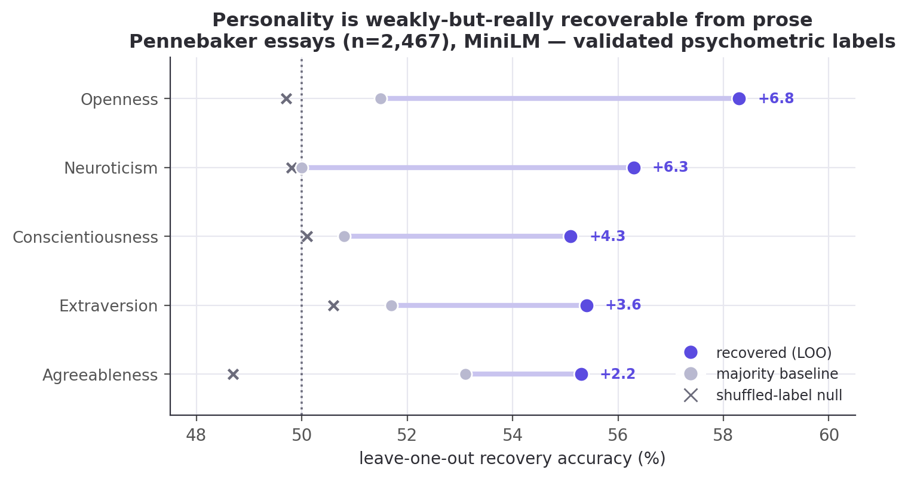
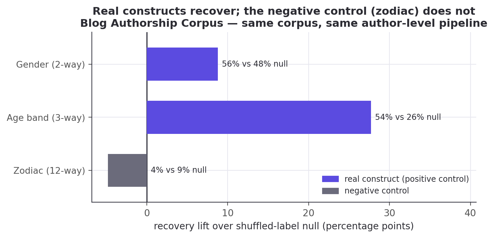
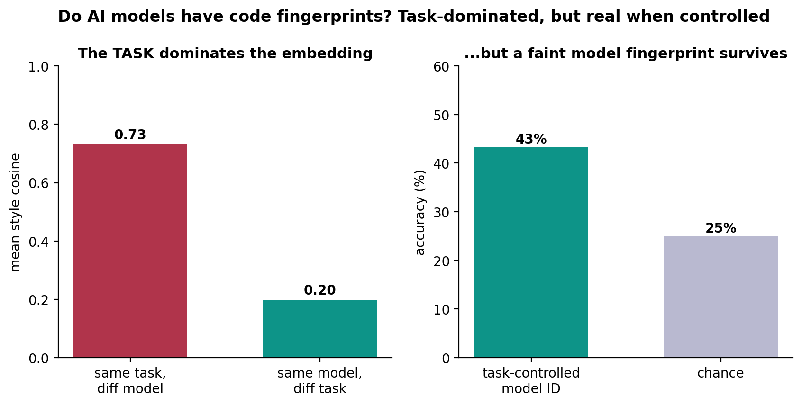

# Author2vec: An Averaged-Jacobian Workspace Lens for Open Embedding Encoders

Tristen Harr · Brahmastra Labs · [author2vec.com](https://author2vec.com)

---

## Abstract

Anthropic's *"Verbalizable Representations Form a Global Workspace in Language Models"*
introduces the averaged-Jacobian lens (J-lens) and reports that a large closed decoder
(Claude Sonnet 4.5, 127 layers) maintains a privileged "workspace" of verbalizable,
causally-active concepts, marked by structural depth signatures of the layer Jacobian. We ask
whether that apparatus survives transplant to a setting it was not built for: small open embedding
encoders whose output is a single masked-mean-pooled vector. Three ingredients carry it across: a
δ-broadcast reduction that collapses the encoder's position×position Jacobian to one matrix per
layer (proven equal to the mean per-position Jacobian); an embedding-space projection for the
L2-normalized output (proven exact); and a style lens that reads the layer Jacobian onto
interpretable axes rather than the token vocabulary. We re-point the lens at a target the original
could not check from the outside, authorship identity, across a 6-layer prose encoder (MiniLM), a
12-layer code encoder (JinaBERT), and a 12-layer open decoder (GPT-2). Our main finding is that the
workspace's structural geometry transfers: a low-rank mid-network bottleneck on the encoders that
sharpens into a clean inverted-U on the decoder. Identity is linearly decodable at every layer;
measured against a plain-activation probe, the Jacobian readout ties it on prose and modestly
exceeds it mid-network on code (best $50.8\%$ vs. $48.8\%$, chance $6.7\%$), so the Jacobian earns
its place through geometry, not decode accuracy. As a construct-validity check the same embeddings
recover self-reported Big Five personality weakly but reliably (Openness $+6.8$ points; all five
traits $p<0.001$ against a shuffled-label null), while an astrological-sign negative control
recovers nothing ($p=0.96$), which is also why we make no cognitive-capacity claim. Everything runs
on open models and reproduces on a laptop, every cited number machine-extracted into an audit
ledger. We separate replication from new results throughout, and claim no "IQ" and no consciousness.

## Contributions

1. **An encoder adaptation of the averaged-Jacobian J-lens** via the δ-broadcast reduction
   (§4.2), redefining the method for a masked-mean-pooled, non-generative encoder, with a proof
   that it equals the mean per-position output Jacobian (Prop. 1).
2. **An embedding-space Jacobian projection** for L2-normalized outputs (§4.3), proven to be the
   exact Jacobian of the normalized embedding and orthogonal to it (Prop. 2).
3. **The style lens** (§4.5): a Jacobian readout onto interpretable identity axes rather than
   the token vocabulary, the usable signal where a pooled encoder has no clean unembedding.
4. **The workspace's structural depth geometry transfers to open models** (§5.3, §5.4): a
   low-rank mid-network bottleneck on the encoders sharpens into a clean inverted-U on a 12-layer
   decoder (GPT-2). This is where the averaged Jacobian is load-bearing.
5. **A depth study of authorship identity as a checkable target**: identity is linearly decodable
   at every layer and benchmarked against a plain probe (§5.1), commits to a single individual with
   depth (ignition, §5.2), and is a sign-controllable causal lever (§5.5).
6. **A measured-population construct-validity check with a negative control** (§5.6): on 2,467
   psychometrically-labelled essays the same embeddings recover self-reported Big Five personality
   above a shuffled-label null on all five traits (Openness $+6.8$; all five $p<0.001$ by a
   1000-permutation test), while an astrological-sign negative control recovers nothing ($p=0.96$).
7. **An open, reproducible, browser-native reimplementation** across prose, code, and a decoder,
   with a faithfulness gate and a full audit ledger.

The new method is narrow: the δ-broadcast reduction (1) and the embedding-space projection (2) are
what make the averaged-Jacobian lens run on a pooled encoder at all, with the style lens (3) as the
readout they enable. Contribution 4 is the empirical headline, the structural-geometry transfer;
5 applies established techniques (difference-of-means directions, probing across depth, the ignition
design) to a new target, authorship identity read through the layer Jacobian; 6–7 are the
construct-validity check and the open reimplementation.

---

## 1. Introduction

Recent interpretability work argues that large language models maintain a privileged, verbalizable
"workspace" of representations: a small subset of activations that are reportable, controllable,
and causally responsible for reasoning [@workspace2026]. That evidence comes from a generative
decoder with hundreds of billions of parameters and privileged internal access, read out with an
averaged-Jacobian lens onto the token vocabulary. It is expensive to reproduce and impossible to
inspect from the outside.

We ask a smaller, checkable question with the same apparatus: where, inside a network, does *who
wrote this* become decidable? We move the averaged-Jacobian lens from a frontier decoder to two
small, open embedding encoders, a 6-layer prose model (MiniLM) and a 12-layer code model (JinaBERT),
and re-point it from reasoning onto personal writing-style identity. An encoder is a minimal testbed
for the reference paper's mechanistic claims because it strips away generation: there is no
autoregressive loop to smuggle information through, only a fixed map from text to a single pooled
vector. It cannot speak to the paper's behavioral claims (verbal report, reasoning swaps), which
need a capable generative model and are out of scope here; what it can test is whether the
structural *geometry* the paper attributes to the workspace survives, which we then cross-check on
an open decoder (GPT-2, §5.4).

Carrying the lens across that gap takes three ingredients (§4): a δ-broadcast reduction that
collapses the encoder's intractable position×position Jacobian to one matrix per layer; an
embedding-space projection that removes the meaningless radial direction of a normalized output;
and a style lens that reads the layer Jacobian onto interpretable identity axes rather than the
token vocabulary, the trustworthy signal where an encoder has no clean unembedding.

With these we find that author identity is linearly decodable at every layer, not only at the output
(§5.1), and that an ambiguous two-author input drives the internal representation to commit to a
single author increasingly with depth, above two null controls (§5.2). Our central result is
structural: read with the same averaged Jacobian, both encoders show a low-rank mid-network
bottleneck (§5.3), and the same machinery on a 12-layer decoder sharpens that into a clean
inverted-U (§5.4), the workspace depth geometry the reference paper reports in a 127-layer model. We
keep the replication-versus-new boundary sharp throughout and are explicit about what we do not
claim (§7); every result number is machine-extracted into the audit ledger (Appendix D) and gated by
the review harness.

## 2. Related work

**Lenses on the residual stream.** The logit lens [@nostalgebraist2020logitlens] reads
intermediate activations through the unembedding; the tuned lens [@belrose2023tunedlens] learns
an affine correction per layer. The averaged Jacobian of [@workspace2026] generalizes this by
linearizing the *whole* map from a layer to the output and averaging over a corpus. We inherit
that construction and adapt it to a pooled encoder (§4.2); our vocab lens is a logit lens over
tied WordPiece embeddings, and our *style lens* (§4.5) replaces the vocabulary readout with one
onto interpretable directions, the piece that is new here.

**Steering and concept directions.** Activation addition [@turner2023actadd] and contrastive
activation addition [@rimsky2024caa] steer generation by adding a direction to the residual
stream; representation engineering [@zou2023repe] extracts such directions, often as a
difference of class means. A single such direction can be a causal lever (as in refusal, mediated
by one direction [@arditi2024]), and causal-mediation analysis localizes where a
direction acts [@vig2020]. Our identity axes are difference-of-means (Fisher)
directions, used both to *read* (§4.5) and to *steer* (§5.4); the novelty is not the technique
but the target, personal authorship identity, and reading it *through the layer Jacobian*.

**Probing and representational geometry.** Linear probes [@alain2017probing;
@hewitt2019structural] test what a layer linearly encodes; because above-chance probing need not
imply the model *uses* the information [@hewittliang2019], we pair every decode with
control-direction and shuffled-label nulls. We use leave-one-out nearest-centroid
decoding as a probe of *identity* across depth (§5.1). Linear CKA [@kornblith2019cka] compares
representations between layers, which we apply to J-lens readout geometry (§4.7). Sparse
dictionary learning / SAEs [@bricken2023monosemanticity] decompose activations into
interpretable atoms; the paper's J-space decomposition is a supervised cousin we reuse (§4.6).

**Global workspace and authorship.** The framing of [@workspace2026] draws on global workspace
theory [@baars1988workspace] and the "ignition" of conscious access [@dehaene2011ignition]; we
borrow the *ignition* experimental design (§5.2) but point it at identity, and we make no claim
about consciousness. Our substrate is Sentence-BERT-style embeddings [@reimers2019sbert], and
the downstream question, attributing text to its author from style, is classical authorship
attribution / stylometry [@mostellerwallace1964; @stamatatos2009], now often approached with
learned authorship embeddings [@riverasoto2021], here recast as a question about *where in a
network* identity is computed. A known hazard is the content–style confound: apparent authorship
signal can be topic signal [@wegmann2022], which we control on the model side (Appendix E) and flag as
a limitation on the prose side (§7). Throughout, the J-lens, J-space, and structural signatures are the paper's; our
contribution is their transplant to open encoders, the style-lens readout, the identity target,
and full reproducibility.

## 3. Background: the averaged-Jacobian lens

We build directly on the apparatus of [@workspace2026], which we summarize here so that our
adaptation (§4) and its boundaries are unambiguous. Quantitative figures in this section (layer
counts, workspace band, J-space fractions) are that paper's *reported* values; it is a single
online article, so we attribute them to it as a whole rather than by page.

**The J-lens.** For a causal decoder, the *averaged Jacobian* at layer $\ell$ is
$$ J_\ell \;=\; \mathbb{E}_{t,\,t'\ge t,\,\text{prompt}}\!\left[\frac{\partial h_{\text{final},t'}}{\partial h_{\ell,t}}\right], $$
the linearized effect of a layer-$\ell$ activation on the final residual stream, averaged over
token positions and a corpus of prompts. Read through the unembedding it yields, for any
activation, a ranked list of vocabulary tokens the model is "disposed to say", a corrected
logit lens that accounts for representational change across layers.

**J-space and its privilege.** Activations are decomposed into sparse non-negative
combinations of $k$ ($\approx 10$–$25$) J-lens vectors; the *J-space component* is the part of
an activation lying in that cone. Though it accounts for only $\sim 6$–$10\%$ of a concept
vector's variance, it is the part causally responsible for the concept's availability to
verbal report, and it is subject to top-down control (instructing the model to "focus on X"
loads X), mediates unverbalized reasoning intermediates (swapping a J-lens vector redirects
downstream answers), and is required for deliberate (but not automatic) tasks.

**Structural depth signatures.** Four quantities, read off $J_\ell$ across depth (the paper's
Figure 28), identify a workspace band: next-token-prediction accuracy of the readout, its
*excess kurtosis* (peakiness), the *autocorrelation* of the top lens token across positions
(persistence of abstract content), and the readout's *effective linear dimensionality*. All
four mark a consistent sensory → workspace → motor tripartition (noisy early layers, a
coherent middle band, and output-aligned late layers), corroborated by an ambiguous-input
"ignition" experiment in which the representation snaps to one interpretation at workspace
onset. The study is conducted on Claude Sonnet 4.5 (127 layers; workspace $\approx$ L38–92)
and corroborated on Haiku/Opus.

**The gap we step into.** Every one of these constructs is defined for a *generative decoder*
with per-position next-token logits. An embedding encoder has neither: its output is a single
pooled vector. §4 is what it takes to carry the mechanistic half of this apparatus across that
gap; §5.5 (steering on a decoder) and §5.6 (a measured population) are the closest we come to the
behavioral half the encoder cannot reach.

## 4. Method

**Setup.** We study two open embedding encoders: `sentence-transformers/all-MiniLM-L6-v2`
[@wang2020minilm] (prose; 6 layers, $d=384$, vocab 30,522) and
`jinaai/jina-embeddings-v2-base-code` [@gunther2023jina] (code; 12 layers, $d=768$, vocab 61,056).
Each maps a passage to a masked-mean-pooled vector $p=\frac{1}{T}\sum_t h_{L,t}$; the shipped
embedding is its L2-normalization $\hat p = p/\lVert p\rVert$. A faithfulness gate (`bin/spike`)
asserts our native candle forward reproduces the shipped fastembed embeddings at cosine $>0.99$
before any Jacobian is trusted.

### 4.1 The problem an encoder poses
The causal J-lens is defined per token position toward next-token logits. An encoder emits a
single pooled vector and no logits, so the per-position causal Jacobian is undefined here.

### 4.2 δ-broadcast averaged Jacobian
We perturb every source position by a shared displacement $\delta$ and differentiate the
pooled vector, collapsing the position×position Jacobian to one matrix per layer:
$$ J_\ell \;=\; \frac{1}{T}\,\frac{\partial p}{\partial \delta}\Big|_{\delta=0}\;=\;\frac{1}{T}\sum_{t=1}^{T}\frac{\partial p}{\partial h_{\ell,t}}\;\in\;\mathbb{R}^{d\times d}, $$
which is exactly the mean over source positions of the per-position output Jacobian (Prop. 1,
Appendix A), independent of $T$. It is built by batched central finite differences
($\varepsilon=0.05$, pure gemm), not per-dimension autograd. `lib.rs:layer_jacobian`.

### 4.3 Embedding-space projection
The shipped embedding is the L2-normalized $\hat p=p/\lVert p\rVert$, so we compose $J_\ell$ with
the Jacobian of the normalization map to obtain the Jacobian of the actual output:
$$ J_{\text{emb}} \;=\; \tfrac{1}{\lVert p\rVert}\,(I - e e^{\top})\,J_\ell \;=\; \frac{\partial \hat p}{\partial \delta},\qquad e = \hat p. $$
This is exact, not an approximation, and satisfies $e^{\top}J_{\text{emb}}=0$ (Prop. 2, Appendix A):
it discards precisely the radial component that renormalization annihilates. `lib.rs:to_embedding_jacobian`.

### 4.4 Vocabulary (logit) lens
Standardized $J\!\cdot\!h$ times the tied WordPiece embeddings $W_U$ → top tokens. Noisy here
(the checkpoint ships no trained MLM head); reported but not load-bearing. `lib.rs:vocab_topk`.

### 4.5 Style lens
We read the Jacobian onto interpretable identity axes instead of the vocabulary:
$$ s_a(h) \;=\; A_a \cdot \operatorname{normalize}(J_{\text{emb}}\,h),\qquad
   A_a = \operatorname{normalize}\big(\bar{c}^{+}_a - \bar{c}^{-}_a\big), $$
each axis a unit difference-of-class-means (Fisher) direction over the reference
embeddings. Shipped axes, prose: `male ↔ female`, `educated=England ↔ rest`,
`educated=US ↔ rest`, `raised=England ↔ rest`, `raised=US ↔ rest`; code:
`Systems ↔ rest`, `Scripting ↔ rest`. `lib.rs:style_scores`, `axis`, `author_axes`.

### 4.6 J-space decomposition
Non-negative matching pursuit over unit rows of $W_U J_\ell$ yields a sparse concept set and
the fraction of activation variance it captures. `lib.rs:jspace_nmp`.

### 4.7 Structural depth signatures
Per layer: stable rank $\lVert J\rVert_F^2/\sigma_1^2$, effective dimension
(participation ratio $\lVert J\rVert_F^4/\lVert J^\top J\rVert_F^2$), verbalizability
(excess kurtosis of the vocab-lens readout), layer×layer linear CKA, and, completing the
paper's four-metric set, autocorrelation (lag-1 readout persistence vs. a position-shuffled
null). `lib.rs:stable_rank`,
`effective_dim`, `excess_kurtosis`, `linear_cka`, `readout_autocorrelation`.

## 5. Experiments and results

### 5.1 Identity is linearly decodable at every layer


Decoding author identity by leave-one-out nearest-centroid on the internal per-layer
Jacobian readout beats chance at every layer. For prose, the per-layer rates
$[5.2, 7.2, 8.8, 8.0, 7.2, 8.8]\%$ all clear the $1.8\%$ chance (output ceiling $14.4\%$); even the
weakest ($5.2\%$, Wilson $[3.1, 8.7]$, $n{=}250$) excludes chance (binomial $p<0.001$). For code the
rates run far higher, up to $50.8\%$ against a $6.7\%$ chance. The best internal code layer
($50.8\%$, $[44.6, 56.9]$) matches the output-embedding ceiling ($46.8\%$, $[40.7, 53.0]$): the
intervals overlap by $\sim\!8$ points, so the internal readout is *as good as* the
output, not better. Identity is linearly present inside the layers, not only at the output.
_(Wilson 95% CIs, decode sample $n{=}250$; per-layer values in ledger `identity_*`, bounds in
`ci_identity_*`.)_

**Benchmark against a plain probe.** The averaged Jacobian is more expensive than the obvious
baseline: decode identity from the raw mean-pooled activation at each layer, with no Jacobian at
all. We run both. On prose they are statistically indistinguishable, best layer $8.8\%$ (J-lens)
versus $8.4\%$ (plain probe) and mean $7.5\%$ versus $7.0\%$ across layers, well inside the Wilson
intervals above. On code the Jacobian readout does modestly better, mean $44.6\%$ versus $40.9\%$
and best layer $50.8\%$ versus $48.8\%$, with the gap concentrated in the middle of the network
(e.g. layer 8, $42.0\%$ versus $31.6\%$); at $n{=}250$ each per-layer gap is only two to three
standard errors, so we read the mid-network edge as suggestive, not decisive. The honest summary is
that the Jacobian readout never underperforms a plain probe and modestly outperforms it mid-depth on
code, but decode accuracy is not where the averaged Jacobian earns its keep. That is the structural
geometry (§5.3, §5.4) and the steerable direction (§5.5); §5.1 establishes only that identity is
linearly present at every depth, robustly to the readout.

### 5.2 Identity ignition: commitment sharpens with depth

We adapt the paper's ambiguous-input ignition to identity. For an author pair $(A,B)$ we build
a per-depth difference-of-means axis $\hat u_\ell = \widehat{c_{A,\ell}-c_{B,\ell}}$ from their
*training* passages, then blend two *held-out* passages at the input embedding,
$h_0(\alpha)=(1-\alpha)h_0^{B}+\alpha h_0^{A}$, sweep $\alpha\in[0,1]$, and read the commitment
$s_\ell(\alpha)=\hat u_\ell\!\cdot\!(\bar p_\ell(\alpha)-m_\ell)$ at every depth (15 pairs). A
graded layer ramps linearly in $\alpha$; an *ignited* layer snaps.


**The representation commits to one author, increasingly with depth.** Endpoint separation along
the identity axis rises from $0.36$ at the input to a mid-network peak of $0.95$ at depth 4
(of 6; $\pm0.19$ SEM over $15$ author pairs), then eases to $0.54$ at the output. It dominates both
controls at every depth: the random-direction null sits at $0.06$–$0.14$ (a $\sim\!7\times$ margin
at the peak) and the shuffled-label null at $0.12$–$0.47$. So the effect is identity-specific, not a generic
consequence of blending inputs. The ignition index (transition sharpness, $0$ = graded, $1$
= all-or-none) climbs from $0.09$ at the input (where the readout is, correctly, linear in the
blended input) to $0.73$–$0.74$ by mid-depth and holds. In short: *shallow layers hold a graded
mixture; by the middle of the network the representation has snapped to a single author.* The
mid-network peak echoes the low-rank "workspace-like" bottleneck we see structurally (§5.3).

**The same holds for code, more strongly.** On the 12-layer code encoder the ignition index
climbs from $0.09$ at the input to a peak of $0.82$ (depth 11 of 12). Through the early-mid layers
the identity axis separates developers far above the random-direction null: a $\sim\!13\times$
margin at depth 4 ($1.21$ vs $0.09$; raw separation peaks slightly earlier, $1.56\pm0.22$ at depth
3). It is a sharper version of the same effect, consistent with code identity being more linearly
accessible overall (§5.1). Separation spikes higher still at the final layer ($2.33$), but that
depth is noisy: its wide $\pm0.53$ SEM and a jumping null are why we feature the stable early-mid
layers. Both modalities show the representation committing to one individual with depth.

Two caveats bound this reading. It rests on a 6-layer encoder and 15 pairs. And although the
separation control confirms the axis is identity-specific, we
cannot fully exclude that some of the depth-wise sharpening reflects generic late-layer
nonlinearity. We report the raw depth series.

### 5.3 Structural signatures across depth


Effective dimension rises with depth in both models (prose $73\!\to\!205$; code $80\!\to\!185$).
The stable rank tells the sharper story: in the 6-layer prose model it is lowest at the
very first layer ($22.1$, rising to $106.9$), so the network compresses to a
low-rank readout immediately, whereas the 12-layer code model has a mid-network
low-rank bottleneck (minimum $20.3$ at layer 5 of 12, with a matching dip in effective
dimension). The mid-network "workspace" geometry the paper reports in deep models appears here
only once there is depth to spare. The fourth signature, autocorrelation (persistence of
the readout across positions), completes the picture: near zero or negative at the shallowest
layers and rising through the middle (prose peaks at $0.12$ around layer 4; code climbs to
$\approx 0.09$ by layers 8–9), the workspace-persistence signature of [@workspace2026] surfacing
even on these shallow encoders. We do not see the paper's clean sensory→workspace→motor
tripartition (6–12 layers is too shallow), and we report the raw depth series rather than
forcing that reading.

### 5.4 Structural signatures on a decoder (GPT-2)

Everything above is on *encoders*. If the depth-wise workspace geometry is a real property of the
J-lens apparatus and not an artifact of masked-mean pooling, then reading a generative
decoder with the *same* averaged-Jacobian machinery should reproduce the paper's Figure-28 depth
signatures. Hypothesis: on an open decoder we will see (i) the four Jacobian signatures vary
with depth, and (ii) a decoder-only signature, next-token logit-lens accuracy, rise sharply in
the late layers, marking the "motor" regime where representations turn toward the output. We do
not expect the clean sensory→workspace→motor tripartition: GPT-2 is 12 layers, far short of
the paper's ~100, so we report the raw series and let it say what it says.

**Method.** On GPT-2 [@radford2019gpt2] (`openai-community/gpt2`; 12 layers, $d{=}768$) we run the
δ-broadcast averaged Jacobian, made causal (perturb every position, read the *last* position, the
next-token driver), over prose prompts. The four signatures use the *same* `lib.rs` functions as
the encoders, and verbalizability is read through GPT-2's real tied unembedding (no approximation).
This is the paper's mechanistic apparatus on an open model that actually generates.


**Result: both predictions hold, and more cleanly than on the encoders.** Next-token accuracy is
near zero through the first six layers and then climbs steadily to $22.6\%$ at the output. This is
hypothesis (ii): the late layers are the motor regime. The Jacobian's stable rank and effective
dimension trace a pronounced inverted-U: low at the input ($2.6$ / $5.8$), high through the
middle ($6.7$ / $33.5$ at layer 5), collapsing to near rank-one at the output ($2.0$ / $4.1$). This
inverted-U is *sharper on the 12-layer decoder than on the 6-layer encoders*, just as the "needs
depth to spare" reading predicts (hypothesis (i)). Autocorrelation
rises with depth to a peak of $0.16$ (layer 10) before easing to $0.11$ at the output, echoing the
encoder workspace-persistence.

Two caveats bound this. Final-layer next-token accuracy ($22.6\%$) is low (archaic literary prose,
a 48-token context, 10 prompts), so read the accuracy *shape*, not its level. And our motor-end
*collapse* is the opposite of the paper's motor behavior (there $J_\ell\!\to\!$ identity, full
rank). The difference is deliberate and methodological: our decoder Jacobian reads the last
position (the next-token driver), which naturally becomes low-rank as the network commits to a
single output, rather than the full residual stream the paper differentiates. The workspace
geometry transfers; the motor *readout* is ours, and we flag it as such.

### 5.5 The identity direction is a causal lever

Reading a direction is weaker than showing the network acts on it. We form the residual steering
direction $\hat\delta=\widehat{J_{\text{emb}}^{\top}A}$ from a style axis $A$ and inject
$\alpha\hat\delta$ (broadcast to every position) at the mid layer. This drives the output's loading
on $A$ through a large, sign-controllable swing: monotonic from negative (at $\alpha=-6$) through
zero (unperturbed) to positive (at $\alpha=+6$), saturating (and for gender slightly reversing) at
the extremes. The effect has the same sign across all five prose identity axes
(gender, education, upbringing), though not the same magnitude: the gender axis swings least
($0.80$), the other four up to $1.11$. A matched-norm random direction, injected identically, leaves
the loading essentially flat (total drift $\le 0.16$ over the same sweep). So the mid layer holds
the identity direction as something the rest of the network *acts on*, not merely correlates with.

**A leakage-free check on the decoder.** The encoder steer reads back on the same axis it perturbs,
so we repeat the test on GPT-2 with an independent readout. We build a concept-context direction as
the difference of mid-layer mean residuals between concept-primed and neutral prompts (not the
target's unembedding), inject $\pm\alpha\hat\delta$ at the mid layer, and measure held-out
concept-token log-probability. The direction is a sign-controllable handle, raising concept-token log-prob by
$+0.10$/$+0.22$/$+0.44$ (money / music / war) for $+\alpha$ and lowering it below baseline for
$-\alpha$; the mean effect is $+0.254$ versus $-0.085$ for a matched-norm random control. It is real
and bidirectional but small (it shifts the distribution, not the argmax output) and rests on
3 concepts × 6 prompts, so we report it as the mechanistic prerequisite the paper's behavioral
experiments rely on, not the behavioral result itself. Redirecting a reasoning intermediate to
change a final answer needs a model that can reason; that is future work (§7).

### 5.6 Measured constructs, a negative control, and why we make no "IQ" claim

Every attribute so far (gender, region, systems-vs-scripting) is a *label we assigned*. The
sharpest test of whether these embeddings carry real psychological signal is to hand them a
population whose attributes were measured by someone else, with a validated instrument, and
ask whether the signal survives. Hypothesis: if prose style encodes personality at all, an
embedding built with no knowledge of psychology should recover self-reported Big Five traits above
chance. Method: the Pennebaker & King stream-of-consciousness corpus [@pennebaker1999], $2{,}467$ essays, each
labelled with the writer's Big Five traits from a self-assessment questionnaire (ground truth, not
our guess), embedded with the *same* MiniLM used throughout. For each trait we run leave-one-out
nearest-centroid classification (high vs. low group) against the majority-class baseline, with a
shuffled-label null.



**Result: every trait beats a shuffled-label null, and the null is flat.** Openness is
strongest at $58.3\%$ (majority $51.5\%$; $+6.8$ points), then Neuroticism $56.3\%$ ($+6.3$),
Conscientiousness $55.1\%$ ($+4.3$), Extraversion $55.4\%$ ($+3.6$), Agreeableness $55.3\%$
($+2.2$), a mean lift of $+4.6$ points over the majority baseline. A 1000-permutation test, which
shuffles the trait labels and re-runs the whole classifier, puts all five traits at $p<0.001$
against that null (which sits at chance, $49.9$–$50.1\%$): the classifier is extracting real trait
signal, not fitting noise. The permutation test is against label-shuffling, not the majority
baseline, so we also check each trait's Wilson 95% interval against its majority class: Openness
clears it comfortably ($58.3\%$, $[56.3, 60.2]$ vs. $51.5\%$), but Agreeableness only marginally
($55.3\%$, $[53.3, 57.2]$ vs. $53.1\%$), its lower bound barely exceeding the baseline. The lift over
majority is weak for the lowest traits, as expected.
This is the *weak-but-real* ceiling the personality-from-text literature reports
[@mairesse2007], and Openness-leads-the-pack is a standard finding at social-media scale
[@schwartz2013]. It is a positive result on a measured
population: author2vec, trained for nothing of the kind, carries a faint but real trace of who the
writer is.

**A negative control: what the method does *not* recover.** A positive result could still, in
principle, be spurious structure. The decisive test is to pair it with an attribute that *should*
be unrecoverable and confirm the method stays silent. The Blog Authorship Corpus [@schler2006]
labels every blogger with gender, age, and astrological sign: the first two have
linguistic correlates, the third has none. We pool posts to the author level (138 authors with a
known sign; each author is the mean of their post embeddings) and run the *identical*
leave-one-author-out nearest-centroid classifier on all three, each against a shuffled-label null.



Age band recovers strongly and significantly: $53.6\%$ (majority
$43.5\%$) against a $31.6\%$ shuffled-label null, $p<0.001$ over 1000 permutations, while
astrological sign shows
*nothing*: $4.3\%$, *below* both its majority baseline ($11.6\%$) and its shuffled null ($8.2\%$),
$p=0.96$ (the real labels do worse than $96\%$ of random relabelings). Gender lands in between,
directionally positive but not significant at this modest sample ($56.5\%$ against a $49.7\%$
null, $p=0.08$), consistent with a weak signal that $138$ author-level points are
underpowered to confirm. The contrast is unambiguous: the *exact* pipeline that
recovers a construct with a linguistic basis (age) finds nothing in the astrological
control. This is the boundary a "measured population" is *for*: evidence that the recovered
signal is real where a real construct exists, and absent where none does. This check reads the
pooled output embedding, not the layer Jacobian, so it validates the *embeddings and corpus*, not
the lens; its role is to license, and to bound, the identity signal the rest of the paper reads
through $J_\ell$.

Those two results together are why we make no "IQ" claim. A validated psychometric construct tops out a
few points over chance; a loaded, poorly-operationalized one like "intelligence" would fare no
better and would invite far worse misreading. Whether one can steer a *capability* score (a
vocabulary test administered to a decoder) is a question for a capable model with careful construct
validation. That is future work, not a result we have, and we make no intelligence claim.

### 5.7 Ablations

Rather than a hyperparameter sweep, the study carries several *built-in* ablations. Readout: §5.1
decodes identity from the layer Jacobian and from the raw activation with no Jacobian, and the two
are within noise on prose (the Jacobian modestly ahead on code), so the identity-at-every-layer
result does not depend on the Jacobian readout. Depth: the 6-layer prose vs. 12-layer code encoders
act as a depth ablation, with the mid-network workspace bottleneck (§5.3) and the ignition peak
(§5.2) pronounced only in the deeper model. Model class: the GPT-2 decoder (§5.4) ablates
encoder → generative on the *same* apparatus, and the workspace geometry survives.
Controls-as-ablations: every causal claim ablates its direction against a matched-norm random
and/or shuffled-label null (§5.2, §5.5). What we did *not* sweep, finite-difference $\varepsilon$
and Jacobian context length, we flag as future work; the signatures reproduce bit-for-bit at the
documented settings, so the qualitative curves are stable.

## 6. Discussion

**What the identity-workspace analogy supports.** Read with the same averaged-Jacobian apparatus as
[@workspace2026], an embedding encoder does exhibit workspace-like *geometry* around identity: the
fingerprint is linearly present at every layer (§5.1), it becomes increasingly separable and commits
to a single individual with depth (§5.2), the readout compresses through a low-rank mid-network
bottleneck (§5.3), and the identity direction is a causal lever (§5.5). On a real decoder the same
low-rank-in-the-middle signature sharpens into a clean inverted-U (§5.4). The *mechanistic* half of
the paper's picture transfers, and it transfers to a question the paper never asked: *whose style is
this?*

**What it does not support.** None of this is evidence of reportability, reasoning, or anything
cognitive. Our decoder steering moves a distribution, not an answer (§5.5); a validated psychometric
construct recovered from these embeddings tops out only a few points over chance (§5.6). The
"workspace" here is a claim about representational geometry and linear accessibility, not about a
model *knowing* or *reporting* who you are. The defensible reading is the narrow one: personal
writing style is a low-dimensional, causally-active, depth-localized direction in these models'
representations, which is both less than the slogan "the AI knows you" and more precise than it,
because it is checkable on open models.

**Why an encoder was the right testbed.** Stripping away generation removes the decoder story's main
confound (autoregressive leakage) and lets the mechanistic claims stand or fall on geometry alone.
That the same geometry then reappears, more cleanly, on a 12-layer decoder (§5.4) is the strongest
cross-check we can offer at this scale.

## 7. Limitations and threats to validity

**Replication vs. novel.** The J-lens, J-space decomposition, and the four structural signatures
are the paper's [@workspace2026]; our contribution is the encoder adaptation, the style-lens
readout, the identity target, and reproducibility. We are careful not to claim the apparatus.

**Construct scope.** We measure *identity commitment* and (§5.6) a measured-personality signal,
not IQ, not consciousness. We borrow the *ignition* experimental design, not the conclusion.

**The ignition result needs its caveat stated plainly.** The ignition index rising with depth
(§5.2) is measured on the identity axis, and the separation control confirms that axis is
identity-specific (real separation runs $\sim\!7$–$13\times$ above a random-direction null). But we cannot fully exclude
that *some* of the depth-wise sharpening is generic late-layer nonlinearity: any readout of a
linearly-blended input can become more nonlinear with depth. What the controls establish is that
the *axis* carries identity; the raw sharpening curve should be read as suggestive, not decisive.
Our shuffled-label null is also imperfect (its two groups still contain real passages, so it sits
above zero); the random-direction null is the cleaner floor.

**Statistical power.** Ignition uses 15 author/coder pairs and a 7- or 11-point α grid; structural
signatures average over 32–96 passages. These are small, and the ignition *index* at each depth
averages only over the pairs whose endpoints separate along the axis (5–14 of 15, fewest at the
shallowest layers). We report standard deviations and the raw
per-depth series rather than smoothed summaries.

**Reproducibility caveats.** Encoder structural signatures reproduce bit-for-bit on MiniLM across
runs; the deeper JinaBERT numbers differ from an earlier site build generated with different
(undocumented) settings; we report the values from a run with documented settings
(`JLENS_JAC_LEN=64`) and have not re-verified GPU-reduction determinism on the 12-layer model. The
single-averaged, single-direction lens is lossy; the vocab lens is noisy on encoders (no trained
MLM head); finite-difference $\varepsilon$ introduces $O(\varepsilon^2)$ error.

**Scope.** 55 authors / 15 coders on laptop-scale models demonstrate the *mechanism*; that a
frontier model trained on someone's millions of words holds a sharp, personal fingerprint of *that
individual* is a well-motivated extrapolation, not something these data settle. The behavioral half
of the paper (the decoder steering, §5.5) is the hardest to carry over and is where a small open
decoder's limited capability bites; we state it as directional, with negative results reported as
such.

**Content vs. style (prose).** Our public-domain authors write about different subjects, so some
prose "identity" signal is inevitably topic, not style [@wegmann2022]. Unlike the code side, where
we can control the task explicitly (Appendix E), we do not fully disentangle the two on the prose
side; prose identity should be read as *style-or-topic* fingerprinting, not pure style.

### Ethics and broader impact

This work shows that authorship identity and correlates of demographic and psychological attributes
(gender, region, age, Big Five personality) are linearly recoverable from prose and code
embeddings, and that these directions are causally steerable. The apparatus is dual-use: the
same machinery can support de-anonymization of pseudonymous authors, including developers from
name-scrubbed code [@caliskan2015; @narayanan2012], and non-consensual inference of sensitive
attributes, enabling surveillance or profiling [@hovyspruit2016]. We take three positions.
Consent and scope: our prose subjects are public-domain authors and our developer corpus is
public, git-attributed, and name-scrubbed; we make no per-individual attribution claim and
explicitly decline the AI-usage and "intelligence" inferences the method could invite (§5.6,
Appendix E).
Construct restraint: the astrological-sign negative control ($p=0.96$) is included to
show that a recovered signal must be validated against a real construct before use, and to caution
against reading weak correlational demographic signals as ground truth. Mitigation: the
demographic directions we find can also be *removed* (nullspace projection / INLP [@ravfogel2020]),
and we regard attribute erasure and stylistic obfuscation as the appropriate defensive counterpart
to this analysis. We release only open models and public corpora, and no tool aimed at identifying
specific private individuals.

## 8. Reproducibility

**Models.** `sentence-transformers/all-MiniLM-L6-v2` (prose; 6 layers, $d{=}384$) and
`jinaai/jina-embeddings-v2-base-code` (code; 12 layers, $d{=}768$), loaded natively via candle
and gated (`bin/spike`) to reproduce the shipped fastembed embeddings at cosine $>0.99$.

**Pipeline.**
```
cargo run -p corpus --release                 # prose corpus -> person2vec-minilm.{json,bin}
cargo run -p corpus --bin coders --release    # code corpus  -> person2vec-coders.{json,bin}
cargo run -p jlens  --bin spike     --release              # faithfulness gate
cargo run -p jlens  --bin jlens     --release -- <ds> <N>  # -> person2vec-jlens-<ds>.json
cargo run -p jlens  --bin steer     --release -- <ds>      # -> person2vec-identity-<ds>.json
cargo run -p jlens  --bin fingerprint --release -- <ds>    # -> person2vec-fingerprint-<ds>.json (App. E)
cargo run -p jlens  --bin ignition    --release -- <ds>    # -> person2vec-ignition-<ds>.json  (sec 5.2)
cargo run -p jlens  --bin steer_bundle --release -- <ds>   # -> person2vec-steer-<ds>.json     (sec 5.5)
cargo run -p jlens  --bin decoder_structural --release -- 10  # -> decoder-structural-gpt2.json (sec 5.4)
cargo run -p jlens  --bin decoder_steer --release          # -> decoder-steer-gpt2.json         (sec 5.5)
./target/release/embed_texts minilm essays_in.json essays_out.json   # embed Pennebaker essays (sec 5.6)
python3 jlens/paper/recover_bigfive.py        # -> person2vec-bigfive.json  (Big Five recovery)  (sec 5.6)
python3 jlens/paper/recover_blog_demographics.py  # -> person2vec-blog-demographics.json  (neg. control, sec 5.6)
python3 jlens/paper/build_ledger.py           # -> jlens/paper/ledger.json  (every cited number)
python3 jlens/figures/make_figures.py         # -> jlens/figures/*.png
```
`<ds>` ∈ {`minilm`, `coders`}. Env vars: `JLENS_DEVICE` (`metal`|`cpu`), `JLENS_JAC_LEN`
(Jacobian context; default 64 for the encoder binaries, 48 for `decoder_structural`), `JLENS_CHUNK` (finite-difference batch; smaller = less GPU
memory, identical numbers). Determinism: the structural signatures reproduce bit-for-bit
across runs (verified); the ignition null uses a fixed splitmix64 seed. The `/jlens` viewer does
no linear algebra; all quantities are precomputed offline and shipped as static JSON.

**Auditability.** Every quantitative claim resolves through the audit ledger (Appendix D,
`build_ledger.py`) to a source bundle and JSON path; every method claim resolves through
`method_map.md` to a `file:line`.

---

## Appendix A — δ-broadcast reduction and the embedding projection

A masked-mean-pooled encoder produces the pooled vector $p=\frac{1}{T}\sum_{t} h_{L,t}$ and the
L2-normalized output $\hat p=p/\lVert p\rVert$. The full sensitivity of $p$ to the layer-$\ell$
residuals is a rank-4 object $\partial p_i/\partial h_{\ell,t,j}$ of size $d\times(T\times d)$,
intractable to form and to average across variable-length prompts. Perturbing every source
position by the same $\delta\in\mathbb{R}^d$ collapses it to one $d\times d$ matrix.

**Proposition 1 (the δ-broadcast Jacobian is the mean per-position Jacobian).** Let
$h_{\ell,t}(\delta)=h_{\ell,t}+\delta$ for all $t$ and $J_\ell:=\tfrac{1}{T}\,\partial p/\partial\delta\,|_{\delta=0}$. Then
$$ J_\ell \;=\; \frac{1}{T}\sum_{t=1}^{T}\frac{\partial p}{\partial h_{\ell,t}}. $$

*Proof.* Writing $p=p\big(h_{\ell,1}(\delta),\dots,h_{\ell,T}(\delta)\big)$, the chain rule gives
$\partial p/\partial\delta=\sum_{t}(\partial p/\partial h_{\ell,t})(\partial h_{\ell,t}/\partial\delta)=\sum_{t}\partial p/\partial h_{\ell,t}$,
since $\partial h_{\ell,t}/\partial\delta=I$. Divide by $T$. $\square$

So $J_\ell$ is not an approximation to the per-position Jacobian but exactly its average over
source positions. Each column $c$ is estimated by central finite differences with $\pm\varepsilon e_c$
broadcast to all positions,
$$ (J_\ell)_{\cdot c}\;\approx\;\frac{p(+\varepsilon e_c)-p(-\varepsilon e_c)}{2\varepsilon\,T}, $$
whose truncation error is $O(\varepsilon^2)$ by Taylor expansion; columns are computed in batches
(pure gemm) via one `forward_from(ℓ)` per batch. On a causal decoder (§5.5) the identical
construction reads the last position $p=h_{L,\text{last}}$ (the next-token driver) rather than the
mean, giving the causal analog.

**Proposition 2 (the projection is the exact normalized Jacobian).** With $e=\hat p$,
$J_{\text{emb}}:=\tfrac{1}{\lVert p\rVert}(I-ee^{\top})J_\ell$ satisfies
$$ J_{\text{emb}} \;=\; \frac{\partial \hat p}{\partial\delta}\Big|_{\delta=0}, \qquad e^{\top}J_{\text{emb}}=0. $$

*Proof.* The Jacobian of the normalization $n(p)=p/\lVert p\rVert$ is $\partial n/\partial p=\tfrac{1}{\lVert p\rVert}(I-ee^{\top})$
with $e=p/\lVert p\rVert$; composing with $J_\ell=\tfrac{1}{T}\partial p/\partial\delta$ by the chain
rule gives $J_{\text{emb}}=\partial\hat p/\partial\delta$. For orthogonality,
$e^{\top}(I-ee^{\top})=e^{\top}-(e^{\top}e)e^{\top}=0$ since $\lVert e\rVert=1$. $\square$

Radial scaling of $p$ leaves $\hat p$ fixed, so the removed component $e^{\top}J_\ell$ — the
first-order change in $\lVert p\rVert$ — is exactly the part the encoder discards; keeping it would
inject a direction the downstream never sees.

## Appendix B — Per-layer tables

Structural signatures and internal identity accuracy by residual depth, straight from the ledger.

**Authors (MiniLM, 6 layers).** Internal identity accuracy by layer: [5.2, 7.2, 8.8, 8.0, 7.2, 8.8]% (chance 1.8%).

| layer | stable rank | eff dim | verbaliz. | autocorr |
|---|---|---|---|---|
| 0 | 22.1 | 73.5 | 0.50 | -0.004 |
| 1 | 31.4 | 88.8 | 0.51 | +0.004 |
| 2 | 31.2 | 93.0 | 0.53 | +0.048 |
| 3 | 37.2 | 104.6 | 0.50 | +0.101 |
| 4 | 54.5 | 127.6 | 0.49 | +0.116 |
| 5 | 106.9 | 205.2 | 0.61 | +0.088 |

**Coders (JinaBERT, 12 layers, 15 developers).** Internal identity accuracy by layer: [45.2, 44.8, 48.0, 50.8, 40.0, 48.8, 48.0, 40.4, 42.0, 42.0, 42.4, 43.2]% (chance 6.7%).

| layer | stable rank | eff dim | verbaliz. | autocorr |
|---|---|---|---|---|
| 0 | 30.6 | 79.6 | 0.19 | -0.033 |
| 1 | 36.7 | 95.2 | 0.20 | -0.030 |
| 2 | 38.6 | 98.9 | 0.21 | -0.001 |
| 3 | 35.6 | 100.7 | 0.21 | +0.023 |
| 4 | 33.4 | 102.4 | 0.21 | +0.032 |
| 5 | 20.3 | 91.2 | 0.21 | +0.039 |
| 6 | 37.9 | 113.8 | 0.19 | +0.062 |
| 7 | 54.3 | 126.4 | 0.20 | +0.071 |
| 8 | 59.5 | 132.0 | 0.20 | +0.086 |
| 9 | 61.7 | 139.0 | 0.22 | +0.085 |
| 10 | 73.3 | 151.3 | 0.23 | +0.088 |
| 11 | 79.0 | 185.0 | 0.22 | +0.075 |

**Decoder (GPT-2, 12 layers).** Next-token logit-lens accuracy at the 13 residual points (input embedding, then 12 layers): [0.0, 2.6, 2.6, 3.2, 3.2, 4.7, 5.1, 7.2, 10.9, 13.0, 17.0, 21.3, 22.6]%. The four structural signatures below are the 12 layer-Jacobians (depths 0–11), so "the output" is the final residual (22.6%) for next-token accuracy and the last layer for the signatures.

| layer | stable rank | eff dim | verbaliz. | autocorr |
|---|---|---|---|---|
| 0 | 2.6 | 5.8 | 0.89 | +0.007 |
| 1 | 5.0 | 16.2 | 1.81 | +0.050 |
| 2 | 6.3 | 25.8 | 2.44 | +0.031 |
| 3 | 6.4 | 30.3 | 2.08 | +0.047 |
| 4 | 6.6 | 32.1 | 2.15 | +0.044 |
| 5 | 6.7 | 33.5 | 1.94 | +0.052 |
| 6 | 6.5 | 31.1 | 1.90 | +0.058 |
| 7 | 6.5 | 29.9 | 1.57 | +0.099 |
| 8 | 6.7 | 32.5 | 1.26 | +0.123 |
| 9 | 5.2 | 23.7 | 1.39 | +0.145 |
| 10 | 3.8 | 13.8 | 1.10 | +0.161 |
| 11 | 2.0 | 4.1 | 0.89 | +0.110 |

## Appendix C — Axis definitions, rosters, and OOD probe sets

**Prose style axes** (`author_axes`): `male↔female` (gender difference-of-means); and the top-2
one-vs-rest classes of the `educated` and `raised` fields: `educated=England↔rest`,
`educated=US↔rest`, `raised=England↔rest`, `raised=US↔rest`. Code style axes (`dataset_axes`):
`Systems↔rest`, `Scripting↔rest` (the `paradigm` trait). Each axis is the L2-normalized difference
of class-mean reference embeddings, a unit Fisher direction, used for both readout and steering.

**Rosters.** 55 public-domain prose authors (`corpus/authors.toml`, labelled with
gender / birth / raised / educated / college) and 15 open-source developers (`corpus/coders.toml`,
git-attributed and name-scrubbed, labelled with a `paradigm` = Systems/Scripting trait).

**OOD probes** for the fingerprint detector (Appendix E). Prose (bar 0.30): four held-out author samples
plus `source code`, `modern chat`, `biology abstract`, `legalese`. Code (bar 0.51): four held-out
coder samples plus `Victorian prose`, `modern chat`, `news headline`, `recipe`.

## Appendix D — Audit ledger
Every number above is generated by `jlens/paper/build_ledger.py` into
`jlens/paper/ledger.json` (value → source asset + JSON path) and cross-checked by the figure
pipeline. Method claims resolve via `jlens/paper/method_map.md`.

## Appendix E — Fingerprint-presence detector and AI-model fingerprinting

Two results that use the same identity geometry but sit off the paper's structural thesis; we record
them here for completeness.

**Fingerprint presence: known identity vs. "blank space".** A calibrated nearest-centroid detector
separates known identities from out-of-distribution text, asking a question the reference paper does
not: is a given person's fingerprint present in the embedding at all? Prose (bar 0.30): known probes
0.62–0.69, out-of-distribution text (code, chat, biology, legalese) 0.10–0.25. Code is tighter
(bar 0.51): known 0.54–0.70, OOD 0.17–0.49; "modern chat" sits just under the bar.


**Fingerprinting the AI models: the task dominates.** If humans have fingerprints, do the *models*
people code with? Here we have ground truth: we generate the code, so we know which model wrote it.
We prompted four frontier models (`claude-opus-4.8`, `gpt-5.6-terra`, `gemini-3.5-flash`,
`deepseek-chat`) across 40 coding tasks (24 canonical + 16 open-ended) and embedded the output in the
same JinaBERT space as the humans (149 of the 160 model×task cells produced non-empty code).



Same-task, different-model code is alike (cosine 0.71), which *looks* like the frontier models have
converged to one style, but a control refutes it: same-model / different-task similarity is only
0.20, so it is the task, not the model, that drives the embedding. Controlling for the task,
leave-one-task-out nearest-model-centroid still recovers which model wrote unseen code at 42%
([34.6, 50.3] Wilson, n=149) against a 25% chance baseline, significantly above a within-task
label-shuffling null (null mean 24%, p<0.001 over 1000 permutations). The models carry a detectable
but faint style, largely masked by what the code *does*. This is the content–style control for the
code side (§7); we make no convergence claim and no individual-usage claim.
